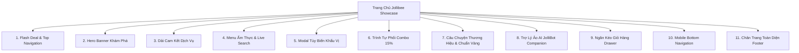

# 🐝 TỔNG QUAN SẢN PHẨM & CÁC BỘ PHẬN CHÍNH
## 🍔 JOLLIBEE INTERACTIVE SHOWCASE & ORDERING EXPERIENCE

---

## 📌 1. TỔNG QUAN SẢN PHẨM (PRODUCT OVERVIEW)

### 1.1. Giới Thiệu Chung
**Jollibee Interactive Showcase** là nền tảng Web trải nghiệm thực đơn và đặt món thế hệ mới dành cho thương hiệu **Jollibee Vietnam**. 
Sản phẩm kết hợp phong cách thiết kế **Cyber-Fastfood** hiện đại với các hiệu ứng kính mờ (**Glassmorphism**), màu sắc nhận diện thương hiệu đỏ - vàng gold đặc trưng, mang lại trải nghiệm thị giác sống động, kích thích vị giác và tối ưu hóa tỷ lệ chuyển đổi đơn hàng.

### 1.2. Mục Tiêu Dự Án
- **Quảng bá hình ảnh thương hiệu**: Nâng tầm trải nghiệm số của Jollibee với giao diện cao cấp, bắt mắt, hiện đại.
- **Tối ưu trải nghiệm đặt món (UX/UI)**: Giúp khách hàng duyệt món ăn, tìm kiếm theo danh mục hoặc từ khóa, tùy biến khẩu vị và đặt món dễ dàng chỉ trong vài thao tác.
- **Trải nghiệm di động chuẩn Native App**: Thiết kế chuyên biệt cho điện thoại thông minh (Mobile First) với thanh điều hướng đáy màn hình, vuốt chạm mượt mà.
- **Tương tác thông minh với AI**: Tích hợp trợ lý ảo **JolliBot (BeeBot Companion)** được cung cấp bởi DeepSeek AI qua Backend Python bảo mật, sẵn sàng tư vấn chọn món theo ngân sách và khẩu vị của khách.
- **Kích thích tiêu dùng với tính năng Tự Phối Combo**: Khách hàng tự do chọn Món chính + Món kèm + Thức uống và nhận ngay ưu đãi giảm giá 15% tự động.

### 1.3. Nền Tảng Công Nghệ Sử Dụng (Tech Stack)
| Tầng Công Nghệ | Công Nghệ / Thư Viện | Vai Trò & Điểm Nổi Bật |
| :--- | :--- | :--- |
| **Giao diện (Frontend)** | **HTML5 Semantic & Tailwind CSS** | Cấu trúc chuẩn SEO, tối ưu khả năng truy cập (Accessibility), bố cục Responsive chuẩn xác trên mọi kích thước màn hình. |
| **Hiệu ứng & Phong cách** | **Vanilla CSS + Glassmorphism** | Nền tối sang trọng kết hợp bảng màu HSL thương hiệu (Đỏ Jollibee `#E31837`, Vàng Ong Mật `#FFC000`), hiệu ứng phát sáng neon vàng óng và đổ bóng chiều sâu. |
| **Hành vi & Tương tác** | **Vanilla JavaScript (ES6+)** | Kiến trúc Clean Code module hóa, quản lý trạng thái (`state`), xử lý giỏ hàng tức thời, lọc tìm kiếm thời gian thực (Live Search). |
| **Hệ thống âm thanh** | **Web Audio API** | Tự động phát âm thanh hiệu ứng (nhấp chuột, thêm giỏ, pháo hoa mừng) bằng thuật toán tổng hợp nốt nhạc, không lo phụ thuộc hoặc lỗi thiếu tệp âm thanh bên ngoài. |
| **Backend & API** | **Python Flask + Flask-CORS** | Đóng vai trò Secure Proxy trung gian kết nối DeepSeek AI API, bảo mật hoàn toàn API Key trên máy chủ thay vì để lộ ở Frontend. |
| **Bảo mật & Biến môi trường** | **python-dotenv** | Quản lý biến cấu hình và khóa API nhạy cảm qua tệp `.env`. |

---

## 📂 2. CẤU TRÚC THƯ MỤC DỰ ÁN

```text
SP của LTk/
├── 📄 index.html              # Trang chủ ứng dụng, chứa toàn bộ cấu trúc giao diện
├── 📄 style.css               # Tùy biến CSS nâng cao, hiệu ứng thanh cuộn, animation
├── 📄 app.js                  # Toàn bộ logic frontend (Giỏ hàng, Menu, Audio, Chatbot, Combo)
├── 📄 README.md               # Giới thiệu tổng quan & hướng dẫn khởi chạy nhanh
├── 📄 HUONG_DAN_CHAY.md       # Cẩm nang chi tiết hướng dẫn cấu hình môi trường & mã nguồn
├── 📄 TONG_QUAN_SAN_PHAM.md   # [Tài liệu này] Mô tả tổng thể và phân tích từng thành phần sản phẩm
├── 📄 requirements.txt        # Danh sách thư viện Python cần thiết (Flask, requests, python-dotenv, flask-cors)
├── 📄 start_server.bat        # File kịch bản khởi động Server Flask & tự động mở trình duyệt với 1 cú click
├── 📄 .env                    # Lưu trữ cấu hình bảo mật cục bộ (DEEPSEEK_API_KEY, PORT)
├── 📄 .env.example            # Mẫu cấu hình biến môi trường an toàn khi chia sẻ
├── 📁 backend/
│   └── 📄 app.py              # Máy chủ Flask trung gian xử lý API Chatbot AI an toàn
└── 📁 assets/                 # Thư mục chứa hình ảnh tài nguyên món ăn, banner, mascot
```

---

## 🧩 3. CHI TIẾT TỪNG PHẦN CHÍNH CỦA SẢN PHẨM

Ứng dụng được chia thành **11 khối chức năng chính**, mỗi khối đảm nhận vai trò cụ thể nhằm tối đa hóa sự tiện lợi và kích thích hành vi mua sắm:



---

### 🔔 PHẦN 1: THANH THÔNG BÁO FLASH DEAL & HEADER GLASSMORPHISM
- **Thanh Flash Sale đếm ngược thời gian thực (Countdown Timer)**: 
  - Nằm ở vị trí trên cùng (`#top-banner`), liên tục đếm ngược theo từng giây (Giờ : Phút : Giây) tạo hiệu ứng tâm lý khan hiếm thời gian (FOMO), kích thích khách hàng đặt món để hưởng ưu đãi.
- **Header Kính Mờ Sticky Glassmorphism (`#navbar`)**:
  - Cố định trên đầu trang khi cuộn (`sticky top-0 z-50`).
  - **Logo Jollibee Vietnam** với hiệu ứng hover phát sáng vàng gold.
  - **Menu Điều Hướng Thông Minh (Scroll Spy)**: Theo dõi vị trí cuộn màn hình và tự động đổi màu phát sáng vàng mục đang xem (*Trang chủ, Thực đơn, Tự phối combo, Câu chuyện*).
  - **Bộ Tiện Ích Trực Quan**:
    - Nút **Bật/Tắt âm thanh hiệu ứng** (`#sound-toggle`) với icon phản hồi trực tiếp trạng thái âm thanh.
    - Nút **Tìm cửa hàng gần nhất** (`#store-locator-btn`).
    - Nút **Giỏ hàng nhanh** (`#cart-toggle-btn`) hiển thị Badge số lượng món đỏ nổi bật và tổng số tiền thanh toán tạm tính ngay trên header.

---

### 🍗 PHẦN 2: HERO BANNER TƯƠNG TÁC CAO CẤP (`#hero`)
- **Thông điệp thương hiệu ấn tượng**: Tiêu đề lớn *"Vị Ngon Giòn Rụm, Niềm Vui Lan Tỏa"* đi kèm badge *"Thương hiệu gà rán số 1 tại Philippines & Việt Nam"*.
- **Cặp nút Kêu Gọi Hành Động (Call To Action - CTA)**:
  - *Nút "Đặt Món Ngay"*: Hiệu ứng đổ bóng vàng rực rỡ, dẫn thẳng người dùng đến phần Menu.
  - *Nút "Tự Phối Combo"*: Kích thích trải nghiệm sáng tạo combo riêng biệt.
- **Hình ảnh đĩa Gà Giòn 3D Nổi Bật (`#hero-chicken-img`)**:
  - Áp dụng animation trôi nổi bồng bềnh êm dịu (`animate-float`).
  - Huy hiệu giảm giá nổi bốc lửa (`-20% GIẢM SỐC HÔM NAY`).
- **Thanh Đảm Bảo Chất Lượng Thực Tế (Social Proof)**:
  - Hiển thị các chỉ số uy tín: Đánh giá **4.9/5⭐**, Giao nhanh **< 30 Phút**, Hơn **50.000+** thực khách hài lòng.

---

### ⚡ PHẦN 3: DẢI CAM KẾT DỊCH VỤ (FEATURES STRIP)
- Thiết kế 4 thẻ tính năng nổi bật nằm ngang dạng hộp kính sang trọng:
  1. 🛵 **Giao Nhanh 30 Phút**: Đảm bảo gà đến tay vẫn giữ trọn độ nóng sốt và giòn tan.
  2. 🍗 **Gà Tươi Chiên Giòn 100%**: 100% nguyên liệu thịt gà tươi sạch được chứng nhận vệ sinh ATTP.
  3. 🍯 **Sốt Độc Quyền Trứ Danh**: Hương vị sốt cay, sốt bơ tỏi và sốt bò bằm bí truyền độc quyền.
  4. 🎁 **Tích Điểm Mỗi Đơn Hàng**: Đổi voucher giảm giá và quà tặng hấp dẫn cho mỗi lần mua sắm.

---

### 📋 PHẦN 4: KHU VỰC THỰC ĐƠN TƯƠNG TÁC & TÌM KIẾM (`#menu-section`)
- **Thanh Phân Loại Danh Mục (Category Tabs)**:
  - Hỗ trợ vuốt trượt ngang mượt mà trên điện thoại.
  - 8 nhóm danh mục phong phú: *Tất cả, Gà Giòn Vui Vẻ, Mì Ý Sốt Bò Bằm, Burger, Cơm, Món Ăn Kèm, Đồ Uống & Tráng Miệng, Combo Tiết Kiệm*.
- **Thanh Tìm Kiếm Món Ăn Tức Thì (Live Search Input `#menu-search-input`)**:
  - Tự động lọc danh sách món ăn ngay khi người dùng gõ từng ký tự mà không cần tải lại trang.
- **Lưới Món Ăn Tinh Gọn (Responsive Grid `#menu-grid`)**:
  - Tự động thích ứng: 1 cột (Mobile), 2 cột (Tablet), 3 - 4 cột (Desktop).
  - Thẻ món ăn gồm: Ảnh món ăn bắt mắt, nhãn `Best Seller` hoặc `Hot`, giá tiền định dạng chuẩn Việt Nam Đồng (`₫`), mô tả vắn tắt và nút *"Thêm Món"*.

---

### 🛠️ PHẦN 5: POPUP TÙY BIẾN KHẨU VỊ MÓN ĂN (`#item-modal-overlay`)
- Khi nhấp vào bất kỳ món ăn nào, popup xuất hiện mượt mà cho phép khách hàng cá nhân hóa món ăn theo đúng sở thích:
  - **Lựa chọn độ cay**: *Không cay (Nguyên vị thơm lừng)* hoặc *Cay giòn (Phủ ớt bắp ngọt đậm đà)*.
  - **Tùy chọn Topping / Upsize**: Thêm sốt phô mai béo ngậy (+7.000₫), đổi sang khoai tây phô mai (+10.000₫), tăng dung tích đồ uống (+5.000₫).
  - **Ghi chú riêng cho đầu bếp**: Nhập yêu cầu đặc biệt (ví dụ: *"lấy phần đùi gà"*, *"ít đá"*, *"cho nhiều tương cà"*).
  - **Bộ tăng giảm số lượng (+ / -)** và nút thêm vào giỏ tức thời.

---

### 🎨 PHẦN 6: TRÌNH TỰ PHỐI COMBO TIẾT KIỆM 15% (`#combo-builder`)
- **Ý tưởng thiết kế độc quyền**: Mang đến trò chơi ghép món thú vị giúp thực khách tự chọn bữa ăn lý tưởng theo 3 bước tuần tự:
  - **Bước 1 (Món Chính)**: Gà Giòn Vui Vẻ, Mì Ý Sốt Bò Bằm, Burger Tôm Giòn hoặc Cơm Gà.
  - **Bước 2 (Món Ăn Kèm)**: Khoai Tây Chiên Vàng, Khoai Tây Lắc Phô Mai, Bánh Xếp Táo Nóng.
  - **Bước 3 (Thức Uống)**: Coca-Cola mát lạnh, Sprite sảng khoái hoặc Trà Đào Hạt Chia thanh nhiệt.
- **Bảng Tóm Tắt Combo Trực Quan (`#summary-name`, `#summary-final-price`)**:
  - Tự động tính tổng giá gốc của 3 món đã chọn.
  - Tự động trừ **chiết khấu khuyến mãi 15%** và hiển thị số tiền thanh toán thực tế siêu hời.
  - Mở khóa nút *"Thêm Combo Vào Giỏ"* ngay khi người dùng chọn đủ 3 bước.

---

### 📖 PHẦN 7: CÂU CHUYỆN THƯƠNG HIỆU & TIÊU CHUẨN CHẤT LƯỢNG (`#story-section`)
- Giới thiệu hành trình phát triển của Jollibee – từ tiệm kem nhỏ trở thành tập đoàn thức ăn nhanh toàn cầu được yêu thích hàng đầu.
- **3 Trụ Cột Cam Kết Vàng**:
  1. *Nguyên liệu chọn lọc khắt khe*: Thịt gà tươi tiêu chuẩn VietGAP, rau sạch vận chuyển mỗi ngày.
  2. *Quy trình chế biến chuẩn mực*: Dầu chiên đạt chuẩn nhiệt độ vàng 175°C giữ độ giòn rụm bên ngoài và ẩm mềm mọng nước bên trong.
  3. *Phục vụ từ trái tim*: Nụ cười nồng ấm và sự chu đáo mang niềm vui trọn vẹn đến từng bữa ăn gia đình.

---

### 🤖 PHẦN 8: TRỢ LÝ ẢO AI JOLLIBOT COMPANION (`#companion-widget` & `#companion-modal`)
- **Linh vật nổi tương tác (Floating Mascot)**:
  - Biểu tượng chú ong Jollibee đáng yêu bay dập dờn ở góc dưới phải màn hình kèm bong bóng thoại mời gọi chào hỏi thân mật.
- **Cửa Sổ Trò Chuyện Trực Tuyến Hiện Đại**:
  - Khung tin nhắn phong cách Glassmorphism, có hiệu ứng gõ chữ (Typing Indicator).
  - Nút gợi ý câu hỏi nhanh: *"Gợi ý món cay cho 2 người"*, *"Combo nào rẻ nhất?"*, *"Gà Jollibee có giòn lâu không?"*.
- **Kiến Trúc AI Đỉnh Cao & An Toàn**:
  - Kết nối qua Backend `backend/app.py` gọi **DeepSeek Chat API**.
  - Tích hợp `systemPrompt` chuyên sâu am hiểu toàn bộ menu, bảng giá, thành phần dị ứng và chương trình ưu đãi của Jollibee.
  - Cơ chế **Fallback phản hồi thông minh**: Tự động trả lời dựa trên kho tri thức dự phòng ngay cả khi mất kết nối mạng hoặc chưa cấu hình API Key.

---

### 🛒 PHẦN 9: NGĂN KÉO GIỎ HÀNG THÔNG MINH (SLIDE-OVER CART DRAWER)
- **Cơ chế hoạt động**:
  - Trượt nhẹ nhàng từ cạnh phải màn hình (`#cart-drawer`) kèm lớp phủ làm mờ hậu cảnh (`#cart-overlay`).
- **Nội dung giỏ hàng**:
  - Danh sách từng món ăn kèm ảnh thu nhỏ, tên món, độ cay/topping đã chọn.
  - Nút tăng/giảm số lượng và nút xóa món nhanh chóng.
- **Bảng Tính Tiền Minh Bạch (`#cart-footer`)**:
  - Tiền món ăn (Tạm tính).
  - Phí vận chuyển tiêu chuẩn.
  - Tổng số tiền thanh toán cuối cùng viết hoa nổi bật.
- **Nút "Tiến Hành Thanh Toán"**:
  - Kích hoạt âm thanh nốt nhạc pháo hoa chào mừng rực rỡ, hiển thị thông báo đặt đơn thành công và tự động làm mới giỏ hàng.

---

### 📱 PHẦN 10: THANH ĐIỀU HƯỚNG ĐÁY CHO MOBILE (BOTTOM NAVIGATION BAR)
- **Tối ưu trải nghiệm sử dụng 1 tay trên điện thoại**:
  - Thanh menu nằm cố định ở đáy màn hình (`fixed bottom-0 left-0 right-0 z-50 md:hidden`).
  - Gồm 5 nút tiện lợi: **Trang Chủ**, **Thực Đơn**, **Phối Combo**, **JolliBot AI**, **Giỏ Hàng** (có badge số lượng phát sáng màu đỏ).
  - Tránh xung đột hiển thị: Tự động điều chỉnh khoảng cách (Padding bottom) của toàn bộ nội dung web để không bị che khuất.

---

### 🌐 PHẦN 11: CHÂN TRANG TOÀN DIỆN (FOOTER)
- Cung cấp đầy đủ thông tin pháp lý và hỗ trợ khách hàng:
  - Tổng đài đặt hàng giao tận nơi: **1900 1533** (hoạt động từ 08:00 - 21:00).
  - Giờ mở cửa hệ thống cửa hàng trên toàn quốc.
  - Các liên kết mạng xã hội chính thức: Facebook, TikTok, Instagram, YouTube.
  - Chứng nhận chất lượng ATTP và bản quyền thương hiệu thuộc về Jollibee Foods Corporation.

---

## 🎯 4. TÓM TẮT ĐIỂM SÁNG VÀ GIÁ TRỊ CỦA SẢN PHẨM

1. **Thẩm Mỹ Đột Phá**: Giao diện kết hợp giữa tính năng thương mại điện tử thực tế và nghệ thuật đồ họa hiện đại (Glassmorphism, Neon Glow, Micro-animations).
2. **Trải Nghiệm Thân Thiện Trên Mọi Thiết Bị**: Phân tách rõ ràng giữa giao diện máy tính để bàn (PC) và thanh điều hướng di động (Mobile App UI).
3. **Mã Nguồn Độc Lập - Gọn Gàng**: Không phụ thuộc vào các framework cồng kềnh, toàn bộ tính năng chạy mượt mà ngay trên bất kỳ trình duyệt nào.
4. **Trợ Lý Ảo Tích Hợp Sẵn Sàng**: Hệ sinh thái AI được bảo vệ an toàn thông qua Backend Proxy, nâng cao tối đa sự tương tác của khách hàng.
